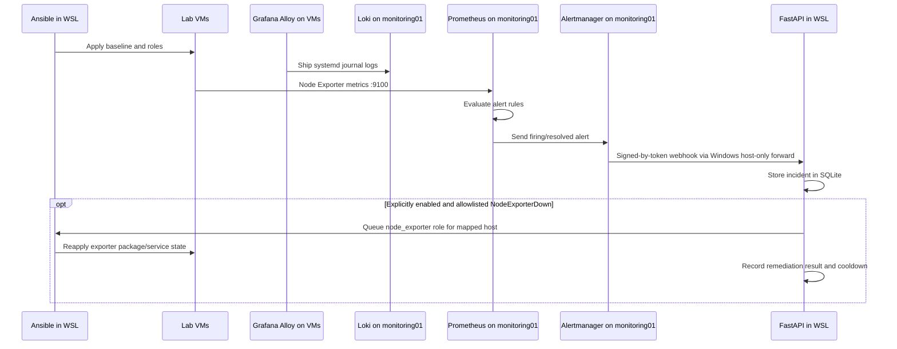
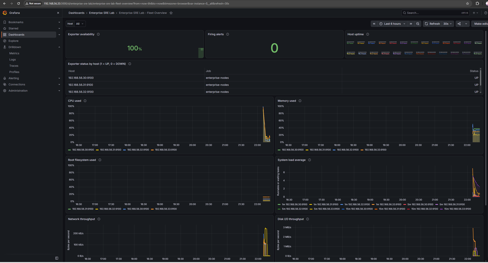
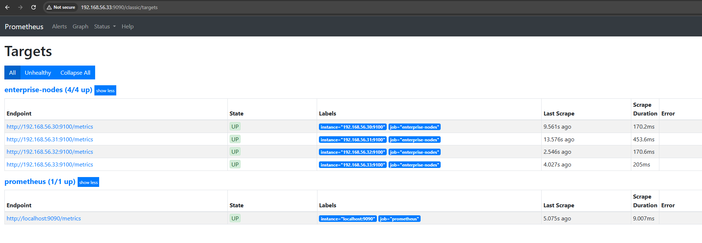
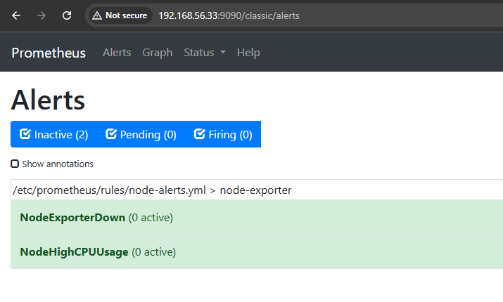
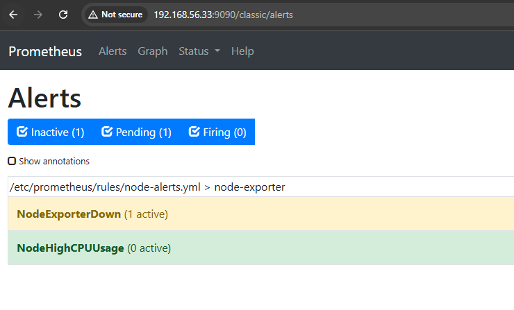
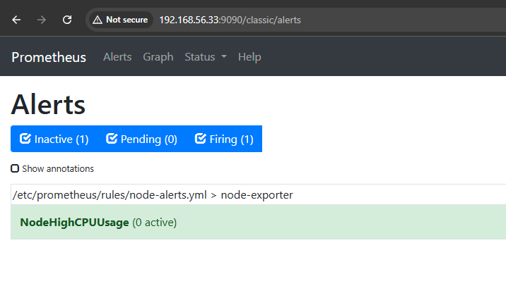
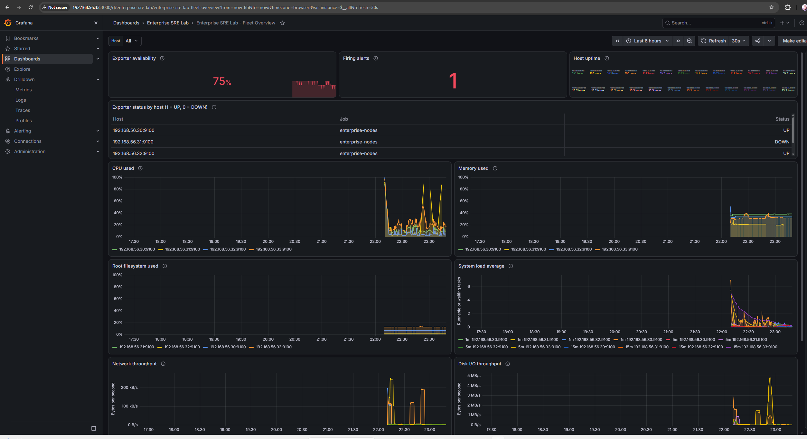

# Enterprise SRE & Infrastructure Automation Lab

A local, multi-VM lab for practicing infrastructure as code, Linux configuration
management, metrics collection, alerting, and API-triggered operations. Vagrant
and VirtualBox provide the infrastructure; Ansible configures it from Ubuntu
24.04 on WSL.

> This is a learning environment, not a production deployment. The API,
> credentials, firewall forwarding, and unauthenticated monitoring UIs should
> remain on your trusted local machine and lab network.

## What the lab includes

- Four Ubuntu and Rocky Linux VMs with static VirtualBox host-only addresses.
- Ansible baseline configuration and reusable roles.
- Node Exporter on every VM, with Prometheus scraping the exporters.
- Grafana Alloy ships systemd journal logs from all four VMs to Loki on
  `monitoring01`, with a provisioned Grafana Loki data source.
- Prometheus alert rules and Alertmanager forwarding incidents to the local
  FastAPI service.
- A token-protected self-service API that runs allowlisted Ansible targets,
  records deployment and alert events in SQLite, and supports opt-in,
  inventory-limited Node Exporter remediation.
- A signed GitHub push webhook endpoint with repository/branch allowlisting
  for triggering a playbook against the API host's current checkout.
- A Windows port-forwarding helper to connect Alertmanager in a VM to the API
  running in WSL.

The baseline, webserver, Node Exporter, Prometheus/Grafana, Loki, and Alloy
roles and the API deployment endpoint are implemented. Alertmanager forwarding,
alert rules, guarded opt-in Node Exporter remediation, and signed GitHub
webhook handling are also implemented. The Windows-to-WSL forwarding and
observability setup must be applied before VM-originated alerts can reach the
API. The GitHub endpoint does not pull repository changes and requires a
separately secured public HTTPS ingress for real GitHub.com delivery.

Loki runs as a single-binary learning deployment with local filesystem storage
and seven-day retention. Grafana Alloy collects systemd journal entries from
the four VMs. This is intentionally limited to the trusted host-only lab
network and is not a production logging architecture.

## Innovation highlights

- **Multi-platform infrastructure as code:** Vagrant and reusable Ansible
  roles provision and configure Ubuntu and Rocky Linux VMs from a WSL-based
  control plane.
- **Event-to-incident automation:** Prometheus alerts flow through Alertmanager
  to the authenticated FastAPI service, where events are recorded in a
  persistent SQLite audit log.
- **Constrained self-service operations:** API requests can start only
  allowlisted Ansible targets; execution results are recorded against ticket
  identifiers.
- **Guarded remediation:** Operators can explicitly enable remediation for
  firing `NodeExporterDown` alerts on known inventory hosts. It is disabled by
  default, limited to the Node Exporter role, and protected by a per-host
  cooldown; it cannot restore an unreachable VM or network.
- **Verified GitHub push handling:** The webhook checks its HMAC signature,
  repository, branch, and delivery ID, and accepts a push only when its commit
  matches the API service's current checkout. It does not fetch or check out
  remote code; GitHub.com requires separately secured, publicly reachable
  HTTPS ingress.

## Architecture

```text
Windows host
  VirtualBox host-only adapter: private address from lab-config.json
       |
       +-- web01         private VM address / Ubuntu 22.04 / Nginx / Node Exporter / Alloy
       +-- app01         private VM address / Rocky Linux 9 / Node Exporter / Alloy
       +-- db01          private VM address / Rocky Linux 9 / Node Exporter / Alloy
       +-- monitoring01  private VM address / Ubuntu 22.04 / Prometheus /
       |                                                Alertmanager /
       |                                                Grafana / Loki /
       |                                                Node Exporter
       +-- All four VMs  Grafana Alloy --> Loki --> Grafana Explore
       |
       +-- Windows port forward host-only-address:5000 -> current WSL IPv4:5000
                                                              |
                                                              v
                                              FastAPI on Ubuntu 24.04 WSL
                                              SQLite audit log
```

Ansible is run from WSL against the VM host-only addresses. Vagrant SSH uses
VirtualBox NAT/port forwarding and is separate from Ansible's direct SSH
connection to those addresses.

### Configure the host-only network

`lab-config.json` is the single source of truth for VM and Windows host-only
adapter addresses: `host_only_ip` sets the adapter IP, and `vm_ips` maps each
VM name to its static address. The checked-in values are private-network
examples, not your laptop's Wi-Fi or Ethernet address. If the example
host-only subnet conflicts with your local network, edit this JSON file before
starting the VMs. Keep the host and all VM addresses on the same unused
private subnet, use unique addresses outside any DHCP range, and configure
the VirtualBox host-only adapter to use the selected host address. Do not
substitute your laptop's LAN-facing IP.

Vagrant, the Ansible inventory, the API's remediation allowlist, Alertmanager,
TLS certificate generation, and the Windows port-forwarding script all read
this file. After changing addresses on an existing lab, update the VirtualBox
host-only adapter, run `vagrant reload`, restart the API, and rerun the Windows
port-forwarding script. If you already generated TLS files, move the existing
`~/.config/enterprise-sre-automation/tls` directory aside before rerunning
`bash automation-api/generate-dev-certs.sh`; then reapply the observability
role so the VM trusts the newly generated CA. The examples and URLs below show
the checked-in defaults; use the corresponding values from `lab-config.json`
if you customize them.

### Operational workflow



The GitHub push endpoint is a separate path: it verifies the push signature
and configured repository/branch, then starts Ansible using the API host's
current checkout. It does not fetch or check out the push commit.

| Inventory group | Host | OS | Services |
| --- | --- | --- | --- |
| `webservers` | `web01` | Ubuntu Jammy | Nginx, Node Exporter, Grafana Alloy |
| `appservers` | `app01` | Rocky Linux 9 | Node Exporter, Grafana Alloy |
| `databases` | `db01` | Rocky Linux 9 | Node Exporter, Grafana Alloy |
| `monitoring` | `monitoring01` | Ubuntu Jammy | Prometheus, Alertmanager, Grafana, Loki, Node Exporter, Grafana Alloy |

### Centralized VM logs with Loki

Grafana Alloy reads the systemd journal on each VM and pushes entries to Loki
on `monitoring01`. In Grafana, open **Explore**, choose the **Loki** data
source, and query `{job="systemd-journal"}`; filter a VM with
`{job="systemd-journal", host="app01"}`. The first collection pass reads at
most one hour of existing journal entries.

Loki uses local filesystem storage with seven-day retention and modest
ingestion/query limits for this lab. Retention is asynchronous and is not a
hard disk quota. Loki has no built-in authentication here; its HTTP listener is
bound to the monitoring VM's host-only address and should not be exposed beyond
the trusted lab network. VM-local log data is lost if `monitoring01` is
destroyed. Treat collected logs as sensitive operational data; do not publish
raw log output or include credentials in commands that may be recorded.

Apply or reapply only the log stack and Grafana's Loki data source from WSL:

```bash
ansible-playbook playbooks/site.yml --tags logging
```

## Screenshots

These captures show the lab in both its healthy baseline and a controlled
Node Exporter failure test. Alert firing and active-state evidence is
preserved separately in
[`docs/screenshots/alertmanager-active-node-exporter-alert.txt`](docs/screenshots/alertmanager-active-node-exporter-alert.txt).

### Grafana fleet dashboard



### Prometheus targets



### Prometheus alert rules at healthy baseline



### Node Exporter alert pending



### Node Exporter alert firing



### Grafana during the exporter-down test



The Debian Alertmanager package does not provide a web UI. Its captured
`amtool` and HTTP API output confirms that the active `NodeExporterDown`
alert was routed to `sre-api-webhook`. The separate
[FastAPI incident evidence](docs/screenshots/fastapi-alertmanager-incident-summary.txt)
records a firing notification for the same target from an earlier test; it is
not timestamp-matched to this screenshot and Alertmanager snapshot.

See [`docs/screenshots/README.md`](docs/screenshots/README.md) for evidence
context and privacy checks before adding further captures.

## Repository layout

```text
.
├── Vagrantfile
├── inventory.yml
├── lab-config.json            # Shared host-only and VM IP configuration
├── ansible.cfg                 # Project example; ignored by Ansible on /mnt/c
├── playbooks/
│   └── site.yml                # Baseline and role orchestration
├── roles/
│   ├── monitoring/             # Node Exporter for Debian and Rocky
│   ├── webserver/              # Nginx and generated landing page
│   ├── observability/          # Prometheus, alert rules, Alertmanager, Grafana
│   ├── loki/                   # Single-node local log storage
│   └── logging/                # Grafana Alloy journal collectors
├── docs/
│   └── screenshots/            # Verified, privacy-reviewed runtime evidence
├── commands-run.md              # Repeatable startup, validation, alert test, and shutdown
├── automation-api/
│   ├── main.py                 # FastAPI endpoints and Ansible runner
│   ├── tests/
│   ├── windows-portproxy.ps1   # Windows-to-WSL forwarding setup
│   └── requirements*.txt
└── ...
```

For a concise, repeatable operational sequence after a laptop/WSL restart, see
the [commands runbook](commands-run.md).

## Prerequisites

On Windows, install:

- Oracle VirtualBox and Vagrant.
- Git for Windows (Git Bash is useful for Vagrant commands).
- The Vagrant `hostmanager` plugin, used by this project's Vagrantfile:

  ```bash
  vagrant plugin install vagrant-hostmanager
  ```

In WSL, use Ubuntu 24.04 and install the Ansible/SSH prerequisites if they are
not already present:

```bash
sudo apt update
sudo apt install -y ansible openssh-client
```

The four VMs allocate **8 GB RAM and 6 vCPUs** in total; `monitoring01` is
configured for 2 vCPUs and 4 GB RAM to run the metrics, alerting, dashboards,
and local log storage. Allow additional memory for Windows and WSL; a host with
16 GB RAM or more is recommended for comfortable use.

Keep the repository under a `enterprise-sre-lab` directory in your own Windows
user profile. Ansible may warn that a Windows-mounted working directory is
world-writable and ignore its project-level `ansible.cfg`. Configure Ansible in
WSL's Linux filesystem instead. From Ubuntu 24.04 WSL, derive the Windows
profile path and add the project-specific settings to `~/.ansible.cfg`:

```bash
WINDOWS_HOME="$(wslpath -u "$(cmd.exe /c 'echo %USERPROFILE%' | tr -d '\r')")"
export PROJECT_DIR="$WINDOWS_HOME/enterprise-sre-lab"
cd "$PROJECT_DIR"

if [ -f "$HOME/.ansible.cfg" ]; then
  cp "$HOME/.ansible.cfg" "$HOME/.ansible.cfg.bak"
fi
python3 - "$HOME/.ansible.cfg" "$PROJECT_DIR" <<'PY'
import configparser
import sys
from pathlib import Path

config_path = Path(sys.argv[1])
project_dir = Path(sys.argv[2])
config = configparser.ConfigParser(interpolation=None)
config.read(config_path)

if not config.has_section("defaults"):
    config.add_section("defaults")

config["defaults"]["inventory"] = str(project_dir / "inventory.yml")
config["defaults"]["roles_path"] = str(project_dir / "roles")
config["defaults"]["host_key_checking"] = "False"
config["defaults"]["retry_files_enabled"] = "False"

with config_path.open("w") as config_file:
    config.write(config_file)

config_path.chmod(0o600)
PY
```

This updates only the listed `[defaults]` settings and preserves other
configuration values. A backup is created before an existing config is updated.

Ansible ignores host-key checking here only because these are disposable local
VMs whose SSH host keys can change when recreated. Do not reuse that setting
for production inventory.

## Provision the virtual machines

From Git Bash:

```bash
cd ~/enterprise-sre-lab
vagrant up
vagrant status
```

In PowerShell, use:

```powershell
Set-Location "$env:USERPROFILE\enterprise-sre-lab"
vagrant up
vagrant status
```

`vagrant up` may request administrator approval for host-manager updates. Check
VM state or connect to a guest with:

```bash
vagrant status
vagrant ssh monitoring01
```

Use `vagrant reload <host>` after changing that VM's Vagrant network settings.
Avoid `vagrant destroy` unless you intend to delete the guest; recreated VMs may
receive new SSH keys.

### Refresh Ansible SSH key copies in WSL

The inventory points to private-key copies in WSL's Linux home so OpenSSH can
use Linux permissions. After a VM is destroyed/recreated, refresh its key from
the generated Vagrant key (repeat for each recreated host):

```bash
cd "$PROJECT_DIR"
install -d -m 700 "$HOME/.ssh/vagrant-enterprise-sre-lab"
chmod 700 "$HOME/.ssh"
install -m 600 \
  .vagrant/machines/monitoring01/virtualbox/private_key \
  "$HOME/.ssh/vagrant-enterprise-sre-lab/monitoring01"
```

## Run Ansible

From the project directory in WSL, test connectivity:

```bash
cd "$PROJECT_DIR"
ansible all -m ping
```

Apply the complete configuration:

```bash
ansible-playbook playbooks/site.yml
```

The playbook runs the baseline on every VM, installs Node Exporter on every VM,
configures Nginx on `web01`, and installs/configures Prometheus, Alertmanager,
and Grafana on `monitoring01`. The observability role expects an API token at
`~/.config/enterprise-sre-automation/api-token` on the WSL controller before it
is applied.

Target a single set of tasks using the playbook tags:

```bash
ansible-playbook playbooks/site.yml --tags baseline
ansible-playbook playbooks/site.yml --tags node_exporter
ansible-playbook playbooks/site.yml --tags webserver
ansible-playbook playbooks/site.yml --tags observability
```

Useful read-only checks:

```bash
ansible-playbook --syntax-check playbooks/site.yml
ansible-playbook --list-hosts playbooks/site.yml
ansible-playbook --list-tasks playbooks/site.yml
```

### Web and monitoring UIs

After the corresponding playbook runs, and while the VMs are running:

- Nginx landing page: `http://<web01-host-only-address>/`
- Prometheus: `http://<monitoring01-host-only-address>:9090/`
- Alertmanager HTTP API: `http://<monitoring01-host-only-address>:9093/`
- Grafana: `http://<monitoring01-host-only-address>:3000/`

Replace each placeholder with the corresponding value in `lab-config.json`.

Grafana's initial package credentials can vary by package/release. Follow the
initial login prompt and set a unique password; do not assume default
credentials are safe.

The Debian Alertmanager package used here does not include its web UI. Use
Prometheus's **Alerts** page to inspect rule evaluation, `amtool` or the
Alertmanager HTTP API to inspect active alerts, and the FastAPI audit log to
review webhook deliveries including resolved notifications. From WSL, query
Alertmanager with:

```bash
ansible monitoring01 -m command -a \
  "amtool --alertmanager.url=http://127.0.0.1:9093 alert query"
```

For the raw active-alert API response:

```bash
ansible monitoring01 -m command -a \
  "curl -fsS http://127.0.0.1:9093/api/v2/alerts"
```

Prometheus scrapes each inventory host on port `9100`. The observability role
deploys rules for a Node Exporter target being down and sustained high CPU usage.
Alertmanager forwards firing and resolved events to the API. Remediation is
disabled unless `AUTO_REMEDIATION_ENABLED=true`; when enabled, only a firing
`NodeExporterDown` alert for a known inventory host can reapply the Node
Exporter role, with a ten-minute cooldown per host. The role installs the local
development CA on `monitoring01` for Alertmanager's HTTPS webhook. Grafana
anonymous access is disabled and viewers cannot edit dashboards; Grafana OSS
provides built-in Viewer/Editor/Admin roles, while fine-grained RBAC depends on
edition.

### How Prometheus and Grafana fit together

Node Exporter runs on each VM and exposes operating-system metrics on port
`9100`. Ansible's `monitoring` role installs and starts that exporter on all
inventory hosts. Prometheus runs on `monitoring01`; its scrape configuration
tells it which exporters to query, and Prometheus stores the returned time
series and evaluates alert rules.

The source of truth for the Prometheus scrape configuration is
`roles/observability/templates/prometheus.yml.j2`. The observability role
renders this Jinja template with host addresses from `inventory.yml` and
deploys the result to `/etc/prometheus/prometheus.yml` on `monitoring01`. It
also deploys alert rules from
`roles/observability/templates/node-alerts.yml.j2` to
`/etc/prometheus/rules/node-alerts.yml`. Before deploying, Ansible validates
the rendered Prometheus configuration and rules with `promtool`; if either
changes, it restarts Prometheus using the handler in
`roles/observability/handlers/main.yml`.

Grafana runs on the same monitoring VM, but has a different job: it queries
Prometheus and turns the metrics into graphs, stat panels, and dashboards.
Grafana does not scrape exporters and does not read `prometheus.yml`. Its
service and access settings are managed by the observability role in
`/etc/grafana/grafana.ini`; the role disables anonymous access and prevents
Viewer users from editing dashboards. Ansible also provisions Prometheus as
Grafana's default data source and installs the **Enterprise SRE Lab** dashboard.

In short: **Node Exporter exposes metrics → Prometheus scrapes and stores them
→ Grafana queries Prometheus and displays them.** Prometheus configuration and
alert rules, plus Grafana's data source and dashboard, are managed as
repository files and reapplied by Ansible.

## Validate Prometheus and build Grafana dashboards

These steps assume the VMs are running and the observability play has been
applied. Ansible provisions the Prometheus data source and the **Enterprise SRE
Lab** dashboard automatically. Use the following UI steps to verify them and,
if desired, create additional dashboards manually.

### 1. Verify Prometheus

Open Prometheus from Windows at
`http://<monitoring01-host-only-address>:9090`, using `vm_ips.monitoring01`
from `lab-config.json`.

1. Select **Status → Targets**. All four targets in the `enterprise-nodes` job
   should show **UP** for all four configured VM targets.
2. Open **Alerts**. `NodeExporterDown` should not be firing when every exporter
   is reachable. `NodeHighCPUUsage` fires only when a host exceeds its configured
   CPU threshold for the full alert duration.
3. Open **Graph** (or **Query**) and run:

   ```promql
   up{job="enterprise-nodes"}
   ```

   Expect four series with value `1`. To count them, run:

   ```promql
   count(up{job="enterprise-nodes"})
   ```

   Expect `4`. If a target is down, open **Status → Targets** and inspect its
   last scrape error before troubleshooting the VM, exporter, or firewall.

### 2. Verify Grafana's Prometheus data source

Open Grafana at `http://<monitoring01-host-only-address>:3000` and sign in
with the Grafana admin account. Use `vm_ips.monitoring01` from
`lab-config.json`. Grafana disables anonymous access, so sign-in is required.

Open **Connections → Data sources → Prometheus**. Ansible configures its
server URL as `http://localhost:9090` and makes it the default data source.
Grafana runs on `monitoring01`, so `localhost` refers to that VM, not your
Windows browser. Run the data-source connection test if shown.

### 3. Open the provisioned fleet dashboard

Open **Dashboards → Browse → Enterprise SRE Lab → Enterprise SRE Lab - Fleet
Overview**. Its panels show exporter availability and per-host status, host
uptime, CPU and memory use, root filesystem use, system load averages, network
throughput, disk I/O, and firing alert details. Use its **Host** variable to
filter panels to one VM or all hosts. Prometheus should return four exporter
series when **All** is selected and all hosts are healthy.

The dashboard JSON is version-controlled at
`roles/observability/files/enterprise-sre-lab-dashboard.json`. The data-source
and dashboard-provider definitions are in
`roles/observability/templates/grafana-prometheus-datasource.yml.j2` and
`roles/observability/templates/grafana-dashboards.yml.j2`. Run
`ansible-playbook playbooks/site.yml --tags observability` to provision or
reapply them.

Provisioned dashboards are managed from the repository and are read-only in
Grafana; change the JSON and rerun Ansible to make edits. Additional dashboards
can still be created manually from **Dashboards → New → New dashboard**.

### 4. Optional: create additional beginner dashboards

The provisioned **Enterprise SRE Lab - Fleet Overview** dashboard is read-only
because Ansible owns its JSON file. To learn by building your own dashboard,
create a separate one in Grafana:

1. Open **Dashboards → New → New dashboard**, then select **Add visualization**.
2. Select the **Prometheus** data source. In the query editor, switch to **Code**
   mode and enter one of the PromQL expressions below.
3. In the panel options, set a clear **Title** and choose a visualization such
   as **Time series**, **Stat**, or **Table**. For percentage metrics, choose
   **Standard options → Unit → Percent (0-100)**. For time-series metrics, set
   the legend to `{{instance}}` to identify each VM.
4. Select **Apply** to add the panel to the dashboard. To add another panel,
   use **Add → Visualization** and repeat the process.
5. When finished, select **Save dashboard**, enter a name such as
   `My SRE Lab Dashboard`, choose a folder, and save. Reopen it from
   **Dashboards → Browse**.

Start with one query and confirm it returns data before adding more panels. If a
panel says **No data**, first run its query in **Explore** with the Prometheus
data source selected. Check that the metric exists and that any label filters,
such as `job="enterprise-nodes"` or `mountpoint="/"`, match the returned series.

For CPU, memory, and filesystem panels, set **Standard options → Unit** to
**Percent (0-100)** and set the legend to `{{instance}}` where the query returns
one series per host. A useful starting point for thresholds is warning at 80%
and critical at 90%; adjust these to suit the lab rather than treating them as
universal production thresholds.

**Dashboard idea 1: Fleet overview**

Create a separate dashboard called **My SRE Lab - Fleet**, then add panels
using the queries below:

| Panel | Visualization | Prometheus query | Expected result |
| --- | --- | --- | --- |
| Nodes up | Stat | `sum(up{job="enterprise-nodes"})` | `4` |
| Status by node | Table or Stat | `up{job="enterprise-nodes"}` | `1` per `instance` |
| CPU used | Time series | `100 * (1 - avg by (instance) (rate(node_cpu_seconds_total{job="enterprise-nodes",mode="idle"}[5m])))` | Percent per host |
| Memory used | Time series | `100 * (1 - node_memory_MemAvailable_bytes{job="enterprise-nodes"} / node_memory_MemTotal_bytes{job="enterprise-nodes"})` | Percent per host |

The status panel uses values `1`
for up and `0` for down; optionally configure value mappings to display these
as **UP** and **DOWN**.

**Dashboard idea 2: Host resources**

Create another dashboard called **My SRE Lab - Host Resources**, then add
these time-series panels:

| Panel | Prometheus query | Unit |
| --- | --- | --- |
| CPU used | `100 * (1 - avg by (instance) (rate(node_cpu_seconds_total{job="enterprise-nodes",mode="idle"}[5m])))` | Percent (0-100) |
| Memory used | `100 * (1 - node_memory_MemAvailable_bytes{job="enterprise-nodes"} / node_memory_MemTotal_bytes{job="enterprise-nodes"})` | Percent (0-100) |
| Root filesystem used | `100 * (1 - node_filesystem_avail_bytes{job="enterprise-nodes",mountpoint="/",fstype!~"tmpfs|overlay"} / node_filesystem_size_bytes{job="enterprise-nodes",mountpoint="/",fstype!~"tmpfs|overlay"})` | Percent (0-100) |

Set `{{instance}}` as each series legend. If the filesystem panel has no data,
inspect `node_filesystem_size_bytes{job="enterprise-nodes"}` in Explore to see
the mount points and filesystem types exported by the hosts, then adapt the
root mount filter accordingly.

**Dashboard idea 3: Alerts and monitoring health**

Create another dashboard called **My SRE Lab - Alerts**, then add these
panels:

| Panel | Visualization | Prometheus query | Expected result |
| --- | --- | --- | --- |
| Firing alert count | Stat | `count(ALERTS{alertstate="firing"}) or vector(0)` | `0` when no alerts fire |
| Active alert details | Table | `ALERTS{alertname=~"NodeExporterDown|NodeHighCPUUsage"}` | Empty when neither rule is pending or firing |
| Prometheus scrape health | Stat | `up{job="prometheus"}` | `1` |

For the alert table, the `ALERTS` series includes labels such as `alertname`,
`instance`, `severity`, and `alertstate`; show the labels as table columns if
desired. A pending alert may appear before it fires, depending on its configured
duration.

Save manually created dashboards as you create them. They live in Grafana's
local database on `monitoring01`, survive a normal VM halt, and are lost if
that VM is destroyed. Unlike the provisioned Enterprise SRE Lab dashboard,
manual dashboards are not backed up or recreated automatically by Ansible.

## Restart the lab after downtime

Use this runbook when returning to the lab after shutting down the VMs or
restarting Windows/WSL. Keep the repository and the WSL files under
`~/.config/enterprise-sre-automation`; they contain the API token and TLS keys
needed by the integration. Do not regenerate them just because the lab was
stopped.

For a normal shutdown, stop Uvicorn with `Ctrl+C` in its WSL terminal, then
halt (do not destroy) the VMs from PowerShell:

```powershell
Set-Location "$env:USERPROFILE\enterprise-sre-lab"
vagrant halt
```

Use `vagrant destroy` only when you intentionally want to delete the VMs and
their locally stored data.

### Start the VMs

From PowerShell:

```powershell
Set-Location "$env:USERPROFILE\enterprise-sre-lab"
vagrant up
vagrant status
```

Wait until all four VMs show `running`. If the VMs were only halted, their
installed services, Grafana password, dashboards, and VM firewall rules remain
on their disks. If you used `vagrant destroy`, the VMs and their local data were
deleted; continue through the recreation steps below.

### Prepare WSL and Ansible

Open Ubuntu 24.04 and run:

```bash
WINDOWS_HOME="$(wslpath -u "$(cmd.exe /c 'echo %USERPROFILE%' | tr -d '\r')")"
export PROJECT_DIR="$WINDOWS_HOME/enterprise-sre-lab"
cd "$PROJECT_DIR"
```

If this is a fresh WSL installation, first complete the Ansible installation
and `~/.ansible.cfg` setup in [Prerequisites](#prerequisites).
If any VM was destroyed and recreated, refresh its SSH private-key copy from
Vagrant before connecting. Refresh all four keys safely with:

```bash
install -d -m 700 "$HOME/.ssh/vagrant-enterprise-sre-lab"
chmod 700 "$HOME/.ssh"
for host in web01 app01 db01 monitoring01; do
  install -m 600 \
    "$PROJECT_DIR/.vagrant/machines/$host/virtualbox/private_key" \
    "$HOME/.ssh/vagrant-enterprise-sre-lab/$host"
done
```

Check that Ansible can reach every VM:

```bash
ansible all -m ping
```

Each host should report `SUCCESS` and `"ping": "pong"`. If the API token or TLS
files under `~/.config/enterprise-sre-automation` are missing, recreate them
using [Run the self-service API](#run-the-self-service-api); never replace an
existing token or CA without also updating the deployed Alertmanager
configuration.

### Reapply configuration after VM recreation

If the VMs were destroyed, or you want to reconcile them to the repository's
Ansible configuration, run:

```bash
ansible-playbook playbooks/site.yml
```

This installs Node Exporter, the web server, Prometheus, Alertmanager, and
Grafana. On Rocky Linux hosts, the Node Exporter role also ensures `firewalld`
is running and persistently allows TCP port `9100` only from the monitoring
host. This rule is reapplied automatically when `app01` or `db01` is recreated.

### Restart the API and restore the Alertmanager connection

If WSL was restarted, start the API in a WSL terminal and leave it running:

```bash
cd "$PROJECT_DIR"
source "$HOME/.venvs/enterprise-sre-automation-api/bin/activate"
export AUTOMATION_API_TOKEN="$(cat "$HOME/.config/enterprise-sre-automation/api-token")"
uvicorn --app-dir automation-api main:app \
  --host 0.0.0.0 --port 5000 \
  --ssl-certfile "$HOME/.config/enterprise-sre-automation/tls/api.crt" \
  --ssl-keyfile "$HOME/.config/enterprise-sre-automation/tls/api.key"
```

In **elevated Windows PowerShell**, refresh the port forward after every WSL
restart because WSL's IP address can change:

```powershell
powershell.exe -ExecutionPolicy Bypass -File "$env:USERPROFILE\enterprise-sre-lab\automation-api\windows-portproxy.ps1"
```

If you destroyed `monitoring01`, or regenerated the API CA, redeploy the
observability configuration from WSL:

```bash
cd "$PROJECT_DIR"
ansible-playbook playbooks/site.yml --tags observability
```

Verify the monitoring VM can validate the API's TLS certificate:

```bash
vagrant ssh monitoring01 -c \
  "sudo -u prometheus curl --cacert /etc/alertmanager/api-ca.crt -fsS 'https://<host-only-address>:5000/healthz'"
```

Run this as `prometheus`, because `/etc/alertmanager` is restricted to root and
the Prometheus service group; the default `vagrant` account cannot traverse it.
Expected response: `{"status":"ok"}`. When testing through Ansible, use
privilege escalation and run curl as the service account:

```bash
ansible monitoring01 -b -m command -a \
  "runuser -u prometheus -- curl --cacert /etc/alertmanager/api-ca.crt -fsS 'https://<host-only-address>:5000/healthz'"
```

### Validate the monitoring stack

From Git Bash in the project directory, check service and endpoint health:

```bash
vagrant ssh monitoring01 -c \
  "systemctl is-active prometheus prometheus-alertmanager grafana-server"
vagrant ssh monitoring01 -c \
  "curl -fsS http://127.0.0.1:9090/-/healthy; echo"
vagrant ssh monitoring01 -c \
  "curl -fsS http://127.0.0.1:9093/-/healthy; echo"
vagrant ssh monitoring01 -c \
  "curl -fsS http://127.0.0.1:3000/api/health"
```

All three services should be `active`; Prometheus and Alertmanager should
report healthy, and Grafana should return `"database":"ok"`. In Prometheus at
the Prometheus URL above, open **Status → Targets** and verify all four
`enterprise-nodes` targets are **UP**. Run `up{job="enterprise-nodes"}` in the
query page; expect four results, each with value `1`. Check **Alerts** for
unexpected firing alerts. Grafana is at the monitoring URL above.

`vagrant halt` preserves VM disks. `vagrant destroy` deletes them; dashboards
and other data created only inside a VM are not backed up or automatically
provisioned by this repository. The API token, CA, and API audit database live
in WSL, so keep the WSL distribution and its home directory if you need to
retain them.

## Run the self-service API

The API is developed and run in WSL. These commands are from the project root:

```bash
sudo apt update
sudo apt install -y python3-venv openssl

python3 -m venv "$HOME/.venvs/enterprise-sre-automation-api"
source "$HOME/.venvs/enterprise-sre-automation-api/bin/activate"
python -m pip install --upgrade pip
python -m pip install -r automation-api/requirements.txt

install -d -m 700 "$HOME/.config/enterprise-sre-automation"
export AUTOMATION_API_TOKEN="$(python -c 'import secrets; print(secrets.token_urlsafe(32))')"
printf '%s' "$AUTOMATION_API_TOKEN" \
  > "$HOME/.config/enterprise-sre-automation/api-token"
chmod 600 "$HOME/.config/enterprise-sre-automation/api-token"
bash automation-api/generate-dev-certs.sh
```

The script creates a local development CA and server certificate outside the
repository in `~/.config/enterprise-sre-automation/tls`, with SANs for
`localhost`, `127.0.0.1`, and the configured host-only IP in `lab-config.json`.
Keep `lab-ca.key` private; only the public CA certificate is deployed to the VM.

### Why the API uses TLS

TLS is what makes an HTTP connection use HTTPS. It encrypts traffic in transit
and lets the client verify that it is talking to the server named in the
certificate. Here, TLS protects API requests and responses—including the API
token and Alertmanager webhook payload—as they travel between WSL, Windows'
host-only forward, and `monitoring01`. The API token authenticates requests;
TLS protects that token while it is being sent. They address different risks
and are both needed for this webhook path.

This lab uses a private, self-signed development CA rather than a publicly
trusted certificate. The API client trusts that CA using `--cacert`, and
Ansible installs only the public CA certificate on `monitoring01` so
Alertmanager can verify the API. The CA private key (`lab-ca.key`) must remain
secret; it is used to sign certificates and is never deployed to a VM. The
certificate generator includes the local addresses used by this lab. If the
API address changes, the certificate must include that address and the
Alertmanager trust configuration must be updated.

#### How the lab certificate is generated

Run the repository script from the project root in WSL after creating the API
token:

```bash
bash automation-api/generate-dev-certs.sh
```

The script uses OpenSSL to create a private development CA key and certificate,
then an API server key and a certificate signed by that CA. The server
certificate includes the lab DNS/IP subject alternative names and is valid for
up to 397 days; the CA is valid for ten years. Files are written outside the
repository under
`$HOME/.config/enterprise-sre-automation/tls` (or under `$XDG_CONFIG_HOME` if
set). The script refuses to overwrite existing TLS material. Keep
`lab-ca.key` and `api.key` private; only `lab-ca.crt` is copied to
`monitoring01`.

Inspect the server certificate's names and validity, and verify its signature
against the local CA:

```bash
TLS_DIR="${XDG_CONFIG_HOME:-$HOME/.config}/enterprise-sre-automation/tls"
openssl x509 -in "$TLS_DIR/api.crt" -noout -subject -issuer -dates -ext subjectAltName
openssl verify -CAfile "$TLS_DIR/lab-ca.crt" "$TLS_DIR/api.crt"
```

The verification command should report `api.crt: OK`. Clients use the CA
certificate to validate the server; do not use `curl -k` as a substitute,
because that disables certificate verification.

TLS is configured on the FastAPI server by starting Uvicorn with its
certificate and private key. The certificate authority does not encrypt or
authenticate the Prometheus or Grafana web interfaces: in this lab those UIs
still use HTTP on the private host-only network. Do not expose them or the
development API directly to an untrusted network. A real internet-facing
deployment needs a properly secured HTTPS ingress and certificates trusted by
its clients.

#### Production TLS and ingress caveat

The certificates above are **not production certificates**. A private lab CA
is trusted only by clients where you explicitly install it, and the WSL,
SQLite, in-process-queue API in this repository is a development service, not a
production automation gateway. Do not make the lab API or port `5000` public
by copying the example below. A real deployment first needs a hardened API
service on a supported host/platform, durable job processing, managed secrets,
restricted deployment permissions, and reviewed authorization, audit, and
recovery controls.

For a properly hardened deployment with a public DNS name such as
`api.example.com`, a common pattern is to put a reverse proxy such as Caddy in
front of an API bound only to localhost. Point DNS to the proxy host and allow
inbound ports `80` and `443` there. Caddy can obtain and renew a publicly
trusted certificate automatically. For example, configure its site in
`/etc/caddy/Caddyfile`:

```caddyfile
api.example.com {
    reverse_proxy 127.0.0.1:5000
}
```

After installing Caddy on that host, validate and reload the configuration:

```bash
sudo caddy validate --config /etc/caddy/Caddyfile
sudo systemctl reload caddy
```

Run the API service bound to localhost behind the proxy, without Uvicorn's
`--ssl-*` options because Caddy terminates public TLS:

```bash
uvicorn --app-dir automation-api main:app --host 127.0.0.1 --port 5000
```

In production, run the API under a hardened service manager or platform rather
than leaving it in an interactive terminal. Permit public inbound traffic only
to the proxy on ports `80` and `443`; do not expose port `5000`. Configure
GitHub to deliver to
`https://api.example.com/api/v1/webhooks/github` with a strong, separately
managed webhook secret. Caddy's automatic certificate flow requires a real
public DNS name and the proxy host to be reachable for certificate issuance.
These commands illustrate TLS termination only; they do not make this lab API
production-ready.

For **local API use and manual requests**, bind to WSL localhost using TLS:

```bash
uvicorn --app-dir automation-api main:app \
  --host 127.0.0.1 --port 5000 \
  --ssl-certfile "$HOME/.config/enterprise-sre-automation/tls/api.crt" \
  --ssl-keyfile "$HOME/.config/enterprise-sre-automation/tls/api.key"
```

In another WSL terminal, load the token into that shell and check the health
endpoint:

```bash
export AUTOMATION_API_TOKEN="$(cat "$HOME/.config/enterprise-sre-automation/api-token")"
curl --cacert "$HOME/.config/enterprise-sre-automation/tls/lab-ca.crt" \
  -sS https://127.0.0.1:5000/healthz
```

### API endpoints

| Method | Path | Authentication | Purpose |
| --- | --- | --- | --- |
| `GET` | `/healthz` | None | Process health check |
| `POST` | `/api/v1/deployments` | `X-API-Key` | Queue an allowlisted Ansible target |
| `POST` | `/api/v1/webhooks/alertmanager` | `Authorization: Bearer <token>` or `X-API-Key` | Record an Alertmanager event |
| `GET` | `/api/v1/tickets` | `X-API-Key` | List paginated audit events |
| `GET` | `/api/v1/tickets/{ticket_id}` | `X-API-Key` | Read one deployment/incident event |

Allowed deployment targets are `baseline`, `node_exporter`, `webserver`,
`observability`, and `all`. Requests cannot provide arbitrary shell commands,
inventory paths, or playbook paths.

Queue a webserver run and inspect its response:

```bash
curl --cacert "$HOME/.config/enterprise-sre-automation/tls/lab-ca.crt" \
  -sS -X POST https://127.0.0.1:5000/api/v1/deployments \
  -H "X-API-Key: $AUTOMATION_API_TOKEN" \
  -H "Content-Type: application/json" \
  -d '{"target":"webserver"}'
```

Use the returned ticket ID to check job status and the bounded Ansible output:

```bash
curl --cacert "$HOME/.config/enterprise-sre-automation/tls/lab-ca.crt" \
  -sS \
  -H "X-API-Key: $AUTOMATION_API_TOKEN" \
  https://127.0.0.1:5000/api/v1/tickets/CHG-your-ticket-id
```

The API runs a single in-process job queue and serializes playbook executions.
Audit records persist in SQLite under `~/.local/state/enterprise-sre-automation`
(or `$XDG_STATE_HOME` if set), but queued jobs do not survive an API process
restart. Run one Uvicorn worker for this lab.

## Connect Alertmanager to the WSL API

The API on WSL localhost is not reachable as `127.0.0.1` from `monitoring01`:
that address would point back to the VM. The configured Alertmanager target is
the Windows VirtualBox host-only address on port `5000`, read from
`host_only_ip` in `lab-config.json`. A Windows port-forward sends that traffic
to the current WSL IPv4 address.

1. Start the API so it listens on WSL interfaces. Keep this terminal running:

   ```bash
   cd "$PROJECT_DIR"
   source "$HOME/.venvs/enterprise-sre-automation-api/bin/activate"
   export AUTOMATION_API_TOKEN="$(cat "$HOME/.config/enterprise-sre-automation/api-token")"
   uvicorn --app-dir automation-api main:app \
     --host 0.0.0.0 --port 5000 \
     --ssl-certfile "$HOME/.config/enterprise-sre-automation/tls/api.crt" \
     --ssl-keyfile "$HOME/.config/enterprise-sre-automation/tls/api.key"
   ```

2. In **elevated Windows PowerShell**, create/update the port proxy and firewall
   rule. The rule allows inbound port 5000 only from the configured
   `monitoring01` address:

   ```powershell
   powershell.exe -ExecutionPolicy Bypass -File "$env:USERPROFILE\enterprise-sre-lab\automation-api\windows-portproxy.ps1"
   ```

   Generate the API CA and certificate with
   `bash automation-api/generate-dev-certs.sh` first. The role installs only the
   public CA certificate on `monitoring01`.

   WSL's IP can change after a WSL restart; rerun the script after such a
   restart. The API must be listening when forwarding is tested.

3. With the API running and the WSL token file present, deploy the receiver,
   Prometheus alert rules, and Alertmanager service from WSL:

   ```bash
   cd "$PROJECT_DIR"
   ansible-playbook playbooks/site.yml --tags observability
   ```

4. From Git Bash, verify that the VM can reach the API through Windows:

   ```bash
   cd ~/enterprise-sre-lab
   vagrant ssh monitoring01 -c "sudo -u prometheus curl --cacert /etc/alertmanager/api-ca.crt -fsS 'https://<host-only-address>:5000/healthz'"
   ```

5. Send a test event from WSL and inspect the audit log:

   ```bash
   export AUTOMATION_API_TOKEN="$(cat "$HOME/.config/enterprise-sre-automation/api-token")"
   curl --cacert "$HOME/.config/enterprise-sre-automation/tls/lab-ca.crt" \
     -sS -X POST https://127.0.0.1:5000/api/v1/webhooks/alertmanager \
     -H "Authorization: Bearer $AUTOMATION_API_TOKEN" \
     -H "Content-Type: application/json" \
     -d '{"receiver":"sre-api-webhook","status":"firing","alerts":[{"status":"firing","labels":{"alertname":"WebhookConnectivityTest","instance":"db01:9100","severity":"warning"},"annotations":{"summary":"Manual webhook test"}}]}'

   curl -sS \
     -H "X-API-Key: $AUTOMATION_API_TOKEN" \
     --cacert "$HOME/.config/enterprise-sre-automation/tls/lab-ca.crt" \
     'https://127.0.0.1:5000/api/v1/tickets?limit=20'
   ```

Prometheus alert delivery is asynchronous. Inspect Prometheus's **Alerts** page
for rule state and use `amtool` or Alertmanager's HTTP API for currently active
alerts; the Debian package does not provide an Alertmanager web UI. Inspect the
FastAPI audit log for delivered firing and resolved webhook events. Only the
explicitly enabled and allowlisted Node Exporter recovery can trigger a
remediation play.

## Test the API code

```bash
source "$HOME/.venvs/enterprise-sre-automation-api/bin/activate"
python -m pip install -r automation-api/requirements-dev.txt
cd automation-api
python -m pytest
```

## Security notes

- Keep API tokens in WSL's home directory, not in this repository. Never commit
  the token file, generated credentials, VM private keys, or SQLite audit data.
- Use the WSL localhost bind for manual-only API use. Binding to `0.0.0.0` is
  only needed for the VM webhook path and should be paired with the included
  restricted Windows firewall/port-forward rule.
- The FastAPI webhook uses HTTPS with a private lab CA; the Prometheus and
  Grafana UIs use plain HTTP on the isolated host-only network. Do not expose
  these services to a public or untrusted network. Production integrations
  need managed certificates and secrets, durable job processing, and stronger
  access control.
- SSH host-key checking is disabled only for this disposable Vagrant inventory.
- Alert payloads and captured playbook output may contain sensitive data; keep
  the local SQLite audit database protected and do not include secrets in
  alerts.
- GitHub webhook secrets are separate from the API token. Signature checking
  and repository/branch allowlists reduce spoofing risk but do not make a
  development server suitable for public exposure.

## License

This project is licensed under the [MIT License](LICENSE).

## Troubleshooting

- **Ansible says the inventory is empty or ignores `ansible.cfg`:** run from
  WSL and set inventory/`roles_path` in WSL's `~/.ansible.cfg`; Windows-mounted
  directories are treated as world-writable.
- **Ansible reports SSH timeout:** check that the VM is running and its
  host-only address matches `inventory.yml`; test from Windows with
  `Test-NetConnection <vm-ip> -Port 22`.
- **Ansible reports `Permission denied (publickey)`:** refresh the WSL key copy
  from `.vagrant/machines/<host>/virtualbox/private_key` with mode `600`.
- **A role cannot find its files:** check that each role is under
  `roles/<role-name>/tasks/main.yml` and that `roles_path` points to this
  checkout.
- **Alertmanager cannot reach the API:** Uvicorn must be listening on WSL
  interfaces with the TLS certificate, the Windows port-forward must point to
  the current WSL IP, and the API token/CA copied by Ansible must match the
  running API token and certificate.
- **No auto-remediation is queued:** remediation is opt-in, handles only
  firing `NodeExporterDown` alerts for known inventory targets, and is subject
  to a ten-minute cooldown. It cannot recover an unreachable VM.
- **GitHub events are rejected:** check the webhook HMAC secret, exact
  `owner/repository` allowlist, configured branch, and delivery event type.
  GitHub.com also needs reachable HTTPS ingress; the local VM forwarding rule
  is not public ingress.

## Learning roadmap

- **Module 1 — Provisioning:** Vagrant, VirtualBox, host-only networking, and
  multi-OS infrastructure.
- **Module 2 — Configuration management:** Ansible inventory, baseline tasks,
  reusable roles, and idempotent service configuration.
- **Module 3 — Observability:** Node Exporter, Prometheus, alert rules,
  Alertmanager, and Grafana.
- **Module 4 — Self-service automation:** FastAPI, allowlisted playbook
  execution, webhook ingestion, and an SQLite audit trail.
- **Module 5 — Planned:** VMware vSphere and Ceph reliability engineering.
