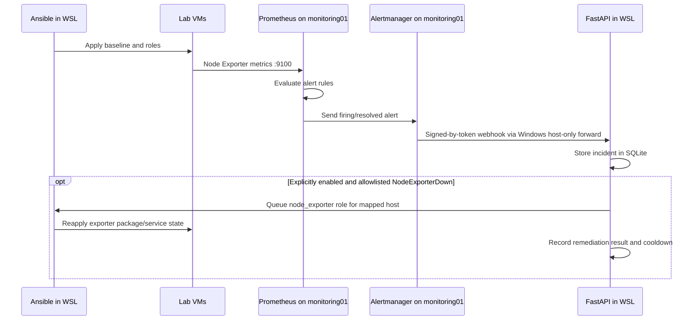

# Enterprise SRE & Infrastructure Automation Lab

A local, multi-VM lab for practicing infrastructure as code, Linux configuration
management, metrics collection, alerting, and API-triggered operations. Vagrant
and VirtualBox provide the infrastructure; Ansible configures it from Ubuntu
24.04 on WSL.

> This is a learning environment, not a production deployment. The API,
> credentials, firewall forwarding, and unauthenticated monitoring UIs should
> remain on your trusted local machine and lab network.

## What the lab includes

- Four Ubuntu and Rocky Linux VMs with static VirtualBox host-only addresses.
- Ansible baseline configuration and reusable roles.
- Node Exporter on every VM, with Prometheus scraping the exporters.
- Prometheus alert rules and Alertmanager forwarding incidents to the local
  FastAPI service.
- A token-protected self-service API that runs allowlisted Ansible targets,
  records deployment and alert events in SQLite, and supports opt-in,
  inventory-limited Node Exporter remediation.
- A signed GitHub push webhook endpoint with repository/branch allowlisting
  for triggering a playbook against the API host's current checkout.
- A Windows port-forwarding helper to connect Alertmanager in a VM to the API
  running in WSL.

The baseline, webserver, Node Exporter, Prometheus/Grafana roles, and API
deployment endpoint are implemented. Alertmanager forwarding, alert rules,
guarded opt-in Node Exporter remediation, and signed GitHub webhook handling
are also implemented. The Windows-to-WSL forwarding and observability setup
must be applied before VM-originated alerts can reach the API. The GitHub
endpoint does not pull repository changes and requires a separately secured
public HTTPS ingress for real GitHub.com delivery.

## Architecture

```text
Windows host
  VirtualBox host-only adapter: 192.168.56.1/24
       |
       +-- web01         192.168.56.30  Ubuntu 22.04 / Nginx / Node Exporter
       +-- app01         192.168.56.31  Rocky Linux 9 / Node Exporter
       +-- db01          192.168.56.32  Rocky Linux 9 / Node Exporter
       +-- monitoring01  192.168.56.33  Ubuntu 22.04 / Prometheus /
       |                                                Alertmanager /
       |                                                Grafana / Node Exporter
       |
       +-- Windows port forward 192.168.56.1:5000 -> current WSL IPv4:5000
                                                              |
                                                              v
                                              FastAPI on Ubuntu 24.04 WSL
                                              SQLite audit log
```

Ansible is run from WSL against the VM host-only addresses. Vagrant SSH uses
VirtualBox NAT/port forwarding and is separate from Ansible's direct SSH
connection to those addresses.

### Operational workflow



The GitHub push endpoint is a separate path: it verifies the push signature
and configured repository/branch, then starts Ansible using the API host's
current checkout. It does not fetch or check out the push commit.

| Inventory group | Host | OS | Address | Services |
| --- | --- | --- | --- | --- |
| `webservers` | `web01` | Ubuntu Jammy | `192.168.56.30` | Nginx, Node Exporter |
| `appservers` | `app01` | Rocky Linux 9 | `192.168.56.31` | Node Exporter |
| `databases` | `db01` | Rocky Linux 9 | `192.168.56.32` | Node Exporter |
| `monitoring` | `monitoring01` | Ubuntu Jammy | `192.168.56.33` | Prometheus, Alertmanager, Grafana, Node Exporter |

## Repository layout

```text
.
├── Vagrantfile
├── inventory.yml
├── ansible.cfg                 # Project example; ignored by Ansible on /mnt/c
├── playbooks/
│   └── site.yml                # Baseline and role orchestration
├── roles/
│   ├── monitoring/             # Node Exporter for Debian and Rocky
│   ├── webserver/              # Nginx and generated landing page
│   └── observability/          # Prometheus, alert rules, Alertmanager, Grafana
├── automation-api/
│   ├── main.py                 # FastAPI endpoints and Ansible runner
│   ├── tests/
│   ├── windows-portproxy.ps1   # Windows-to-WSL forwarding setup
│   └── requirements*.txt
└── configs/
    └── prometheus.yml          # Example/static config; role template is deployed
```

## Prerequisites

On Windows, install:

- Oracle VirtualBox and Vagrant.
- Git for Windows (Git Bash is useful for Vagrant commands).
- The Vagrant `hostmanager` plugin, used by this project's Vagrantfile:

  ```bash
  vagrant plugin install vagrant-hostmanager
  ```

In WSL, use Ubuntu 24.04 and install the Ansible/SSH prerequisites if they are
not already present:

```bash
sudo apt update
sudo apt install -y ansible openssh-client
```

Keep the repository under a `enterprise-sre-lab` directory in your own Windows
user profile. Ansible may warn that a Windows-mounted working directory is
world-writable and ignore its project-level `ansible.cfg`. Configure Ansible in
WSL's Linux filesystem instead. From Ubuntu 24.04 WSL, derive the Windows
profile path and add the project-specific settings to `~/.ansible.cfg`:

```bash
WINDOWS_HOME="$(wslpath -u "$(cmd.exe /c 'echo %USERPROFILE%' | tr -d '\r')")"
export PROJECT_DIR="$WINDOWS_HOME/enterprise-sre-lab"
cd "$PROJECT_DIR"

if [ -f "$HOME/.ansible.cfg" ]; then
  cp "$HOME/.ansible.cfg" "$HOME/.ansible.cfg.bak"
fi
python3 - "$HOME/.ansible.cfg" "$PROJECT_DIR" <<'PY'
import configparser
import sys
from pathlib import Path

config_path = Path(sys.argv[1])
project_dir = Path(sys.argv[2])
config = configparser.ConfigParser(interpolation=None)
config.read(config_path)

if not config.has_section("defaults"):
    config.add_section("defaults")

config["defaults"]["inventory"] = str(project_dir / "inventory.yml")
config["defaults"]["roles_path"] = str(project_dir / "roles")
config["defaults"]["host_key_checking"] = "False"
config["defaults"]["retry_files_enabled"] = "False"

with config_path.open("w") as config_file:
    config.write(config_file)

config_path.chmod(0o600)
PY
```

This updates only the listed `[defaults]` settings and preserves other
configuration values. A backup is created before an existing config is updated.

Ansible ignores host-key checking here only because these are disposable local
VMs whose SSH host keys can change when recreated. Do not reuse that setting
for production inventory.

## Provision the virtual machines

From Git Bash:

```bash
cd ~/enterprise-sre-lab
vagrant up
vagrant status
```

In PowerShell, use:

```powershell
Set-Location "$env:USERPROFILE\enterprise-sre-lab"
vagrant up
vagrant status
```

`vagrant up` may request administrator approval for host-manager updates. Check
VM state or connect to a guest with:

```bash
vagrant status
vagrant ssh monitoring01
```

Use `vagrant reload <host>` after changing that VM's Vagrant network settings.
Avoid `vagrant destroy` unless you intend to delete the guest; recreated VMs may
receive new SSH keys.

### Refresh Ansible SSH key copies in WSL

The inventory points to private-key copies in WSL's Linux home so OpenSSH can
use Linux permissions. After a VM is destroyed/recreated, refresh its key from
the generated Vagrant key (repeat for each recreated host):

```bash
cd "$PROJECT_DIR"
install -d -m 700 "$HOME/.ssh/vagrant-enterprise-sre-lab"
chmod 700 "$HOME/.ssh"
install -m 600 \
  .vagrant/machines/monitoring01/virtualbox/private_key \
  "$HOME/.ssh/vagrant-enterprise-sre-lab/monitoring01"
```

## Run Ansible

From the project directory in WSL, test connectivity:

```bash
cd "$PROJECT_DIR"
ansible all -m ping
```

Apply the complete configuration:

```bash
ansible-playbook playbooks/site.yml
```

The playbook runs the baseline on every VM, installs Node Exporter on every VM,
configures Nginx on `web01`, and installs/configures Prometheus, Alertmanager,
and Grafana on `monitoring01`. The observability role expects an API token at
`~/.config/enterprise-sre-automation/api-token` on the WSL controller before it
is applied.

Target a single set of tasks using the playbook tags:

```bash
ansible-playbook playbooks/site.yml --tags baseline
ansible-playbook playbooks/site.yml --tags node_exporter
ansible-playbook playbooks/site.yml --tags webserver
ansible-playbook playbooks/site.yml --tags observability
```

Useful read-only checks:

```bash
ansible-playbook --syntax-check playbooks/site.yml
ansible-playbook --list-hosts playbooks/site.yml
ansible-playbook --list-tasks playbooks/site.yml
```

### Web and monitoring UIs

After the corresponding playbook runs, and while the VMs are running:

- Nginx landing page: `http://192.168.56.30/`
- Prometheus: `http://192.168.56.33:9090/`
- Alertmanager: `http://192.168.56.33:9093/`
- Grafana: `http://192.168.56.33:3000/`

Grafana's initial package credentials can vary by package/release. Follow the
initial login prompt and set a unique password; do not assume default
credentials are safe.

Prometheus scrapes each inventory host on port `9100`. The observability role
deploys rules for a Node Exporter target being down and sustained high CPU usage.
Alertmanager forwards firing and resolved events to the API. Remediation is
disabled unless `AUTO_REMEDIATION_ENABLED=true`; when enabled, only a firing
`NodeExporterDown` alert for a known inventory host can reapply the Node
Exporter role, with a ten-minute cooldown per host.

## Run the self-service API

The API is developed and run in WSL. These commands are from the project root:

```bash
sudo apt update
sudo apt install -y python3-venv

python3 -m venv "$HOME/.venvs/enterprise-sre-automation-api"
source "$HOME/.venvs/enterprise-sre-automation-api/bin/activate"
python -m pip install --upgrade pip
python -m pip install -r automation-api/requirements.txt

install -d -m 700 "$HOME/.config/enterprise-sre-automation"
export AUTOMATION_API_TOKEN="$(python -c 'import secrets; print(secrets.token_urlsafe(32))')"
printf '%s' "$AUTOMATION_API_TOKEN" \
  > "$HOME/.config/enterprise-sre-automation/api-token"
chmod 600 "$HOME/.config/enterprise-sre-automation/api-token"
```

For **local API use and manual requests**, bind only to WSL localhost:

```bash
uvicorn --app-dir automation-api main:app --host 127.0.0.1 --port 5000
```

In another WSL terminal, load the token into that shell and check the health
endpoint:

```bash
export AUTOMATION_API_TOKEN="$(cat "$HOME/.config/enterprise-sre-automation/api-token")"
curl -sS http://127.0.0.1:5000/healthz
```

### API endpoints

| Method | Path | Authentication | Purpose |
| --- | --- | --- | --- |
| `GET` | `/healthz` | None | Process health check |
| `POST` | `/api/v1/deployments` | `X-API-Key` | Queue an allowlisted Ansible target |
| `POST` | `/api/v1/webhooks/alertmanager` | `Authorization: Bearer <token>` or `X-API-Key` | Record an Alertmanager event |
| `GET` | `/api/v1/tickets` | `X-API-Key` | List paginated audit events |
| `GET` | `/api/v1/tickets/{ticket_id}` | `X-API-Key` | Read one deployment/incident event |

Allowed deployment targets are `baseline`, `node_exporter`, `webserver`,
`observability`, and `all`. Requests cannot provide arbitrary shell commands,
inventory paths, or playbook paths.

Queue a webserver run and inspect its response:

```bash
curl -sS -X POST http://127.0.0.1:5000/api/v1/deployments \
  -H "X-API-Key: $AUTOMATION_API_TOKEN" \
  -H "Content-Type: application/json" \
  -d '{"target":"webserver"}'
```

Use the returned ticket ID to check job status and the bounded Ansible output:

```bash
curl -sS \
  -H "X-API-Key: $AUTOMATION_API_TOKEN" \
  http://127.0.0.1:5000/api/v1/tickets/CHG-your-ticket-id
```

The API runs a single in-process job queue and serializes playbook executions.
Audit records persist in SQLite under `~/.local/state/enterprise-sre-automation`
(or `$XDG_STATE_HOME` if set), but queued jobs do not survive an API process
restart. Run one Uvicorn worker for this lab.

## Connect Alertmanager to the WSL API

The API on WSL localhost is not reachable as `127.0.0.1` from `monitoring01`:
that address would point back to the VM. The configured Alertmanager target is
the Windows VirtualBox host-only address, `192.168.56.1:5000`. A Windows
port-forward sends that traffic to the current WSL IPv4 address.

1. Start the API so it listens on WSL interfaces. Keep this terminal running:

   ```bash
   cd "$PROJECT_DIR"
   source "$HOME/.venvs/enterprise-sre-automation-api/bin/activate"
   export AUTOMATION_API_TOKEN="$(cat "$HOME/.config/enterprise-sre-automation/api-token")"
   uvicorn --app-dir automation-api main:app --host 0.0.0.0 --port 5000
   ```

2. In **elevated Windows PowerShell**, create/update the port proxy and firewall
   rule. The rule allows inbound port 5000 only from `monitoring01`
   (`192.168.56.33`):

   ```powershell
   powershell.exe -ExecutionPolicy Bypass -File "$env:USERPROFILE\enterprise-sre-lab\automation-api\windows-portproxy.ps1"
   ```

   WSL's IP can change after a WSL restart; rerun the script after such a
   restart. The API must be listening when forwarding is tested.

3. With the API running and the WSL token file present, deploy the receiver,
   Prometheus alert rules, and Alertmanager service from WSL:

   ```bash
   cd "$PROJECT_DIR"
   ansible-playbook playbooks/site.yml --tags observability
   ```

4. From Git Bash, verify that the VM can reach the API through Windows:

   ```bash
   cd ~/enterprise-sre-lab
   vagrant ssh monitoring01 -c "curl -fsS http://192.168.56.1:5000/healthz"
   ```

5. Send a test event from WSL and inspect the audit log:

   ```bash
   export AUTOMATION_API_TOKEN="$(cat "$HOME/.config/enterprise-sre-automation/api-token")"
   curl -sS -X POST http://127.0.0.1:5000/api/v1/webhooks/alertmanager \
     -H "Authorization: Bearer $AUTOMATION_API_TOKEN" \
     -H "Content-Type: application/json" \
     -d '{"receiver":"sre-api-webhook","status":"firing","alerts":[{"status":"firing","labels":{"alertname":"WebhookConnectivityTest","instance":"db01:9100","severity":"warning"},"annotations":{"summary":"Manual webhook test"}}]}'

   curl -sS \
     -H "X-API-Key: $AUTOMATION_API_TOKEN" \
     'http://127.0.0.1:5000/api/v1/tickets?limit=20'
   ```

Prometheus alert delivery is asynchronous; inspect Prometheus's **Alerts** page
and Alertmanager's **Alerts** page when testing rule-driven notifications.
Firing/resolved notifications are logged as incidents only.

## Test the API code

```bash
source "$HOME/.venvs/enterprise-sre-automation-api/bin/activate"
python -m pip install -r automation-api/requirements-dev.txt
cd automation-api
python -m pytest
```

## Security notes

- Keep API tokens in WSL's home directory, not in this repository. Never commit
  the token file, generated credentials, VM private keys, or SQLite audit data.
- Use the WSL localhost bind for manual-only API use. Binding to `0.0.0.0` is
  only needed for the VM webhook path and should be paired with the included
  restricted Windows firewall/port-forward rule.
- The lab webhook uses plain HTTP on an isolated host-only network. Do not
  expose it to a public or untrusted network; production integrations should
  use TLS, managed secrets, durable job processing, and stronger access control.
- SSH host-key checking is disabled only for this disposable Vagrant inventory.
- Alert payloads and captured playbook output may contain sensitive data; keep
  the local SQLite audit database protected and do not include secrets in
  alerts.
- GitHub webhook secrets are separate from the API token. Signature checking
  and repository/branch allowlists reduce spoofing risk but do not make a
  development server suitable for public exposure.

## Troubleshooting

- **Ansible says the inventory is empty or ignores `ansible.cfg`:** run from
  WSL and set inventory/`roles_path` in WSL's `~/.ansible.cfg`; Windows-mounted
  directories are treated as world-writable.
- **Ansible reports SSH timeout:** check that the VM is running and its
  host-only address matches `inventory.yml`; test from Windows with
  `Test-NetConnection <vm-ip> -Port 22`.
- **Ansible reports `Permission denied (publickey)`:** refresh the WSL key copy
  from `.vagrant/machines/<host>/virtualbox/private_key` with mode `600`.
- **A role cannot find its files:** check that each role is under
  `roles/<role-name>/tasks/main.yml` and that `roles_path` points to this
  checkout.
- **Alertmanager cannot reach the API:** Uvicorn must be listening on WSL
  interfaces, the Windows port-forward must point to the current WSL IP, and
  the API token copied by Ansible must match the running API token.
- **No auto-remediation is queued:** remediation is opt-in, handles only
  firing `NodeExporterDown` alerts for known inventory targets, and is subject
  to a ten-minute cooldown. It cannot recover an unreachable VM.
- **GitHub events are rejected:** check the webhook HMAC secret, exact
  `owner/repository` allowlist, configured branch, and delivery event type.
  GitHub.com also needs reachable HTTPS ingress; the local VM forwarding rule
  is not public ingress.

## Learning roadmap

- **Module 1 — Provisioning:** Vagrant, VirtualBox, host-only networking, and
  multi-OS infrastructure.
- **Module 2 — Configuration management:** Ansible inventory, baseline tasks,
  reusable roles, and idempotent service configuration.
- **Module 3 — Observability:** Node Exporter, Prometheus, alert rules,
  Alertmanager, and Grafana.
- **Module 4 — Self-service automation:** FastAPI, allowlisted playbook
  execution, webhook ingestion, and an SQLite audit trail.
- **Module 5 — Planned:** VMware vSphere and Ceph reliability engineering.
