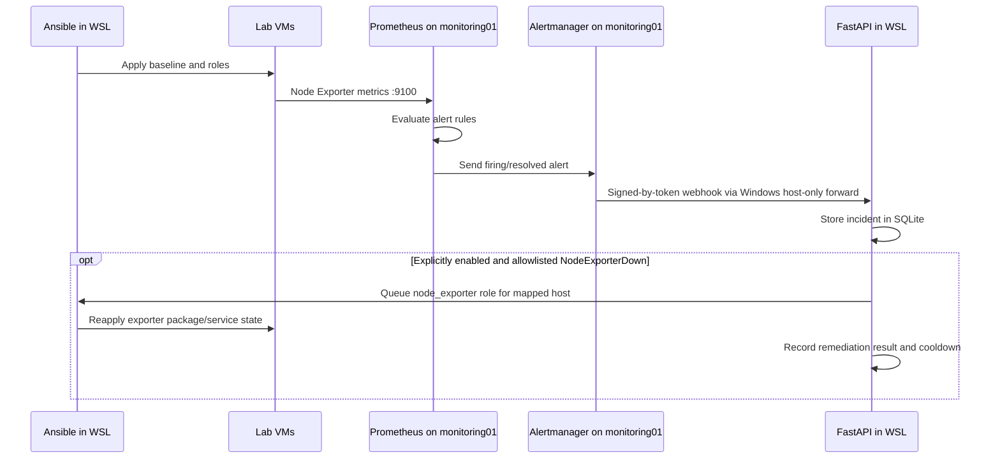

# Enterprise SRE & Infrastructure Automation Lab

A local, multi-VM lab for practicing infrastructure as code, Linux configuration
management, metrics collection, alerting, and API-triggered operations. Vagrant
and VirtualBox provide the infrastructure; Ansible configures it from Ubuntu
24.04 on WSL.

> This is a learning environment, not a production deployment. The API,
> credentials, firewall forwarding, and unauthenticated monitoring UIs should
> remain on your trusted local machine and lab network.

## What the lab includes

- Four Ubuntu and Rocky Linux VMs with static VirtualBox host-only addresses.
- Ansible baseline configuration and reusable roles.
- Node Exporter on every VM, with Prometheus scraping the exporters.
- Prometheus alert rules and Alertmanager forwarding incidents to the local
  FastAPI service.
- A token-protected self-service API that runs allowlisted Ansible targets,
  records deployment and alert events in SQLite, and supports opt-in,
  inventory-limited Node Exporter remediation.
- A signed GitHub push webhook endpoint with repository/branch allowlisting
  for triggering a playbook against the API host's current checkout.
- A Windows port-forwarding helper to connect Alertmanager in a VM to the API
  running in WSL.

The baseline, webserver, Node Exporter, Prometheus/Grafana roles, and API
deployment endpoint are implemented. Alertmanager forwarding, alert rules,
guarded opt-in Node Exporter remediation, and signed GitHub webhook handling
are also implemented. The Windows-to-WSL forwarding and observability setup
must be applied before VM-originated alerts can reach the API. The GitHub
endpoint does not pull repository changes and requires a separately secured
public HTTPS ingress for real GitHub.com delivery.

## Innovation highlights

- **Multi-platform infrastructure as code:** Vagrant and reusable Ansible
  roles provision and configure Ubuntu and Rocky Linux VMs from a WSL-based
  control plane.
- **Event-to-incident automation:** Prometheus alerts flow through Alertmanager
  to the authenticated FastAPI service, where events are recorded in a
  persistent SQLite audit log.
- **Constrained self-service operations:** API requests can start only
  allowlisted Ansible targets; execution results are recorded against ticket
  identifiers.
- **Guarded remediation:** Operators can explicitly enable remediation for
  firing `NodeExporterDown` alerts on known inventory hosts. It is disabled by
  default, limited to the Node Exporter role, and protected by a per-host
  cooldown; it cannot restore an unreachable VM or network.
- **Verified GitHub push handling:** The webhook checks its HMAC signature,
  repository, branch, and delivery ID, and accepts a push only when its commit
  matches the API service's current checkout. It does not fetch or check out
  remote code; GitHub.com requires separately secured, publicly reachable
  HTTPS ingress.

## Architecture

```text
Windows host
  VirtualBox host-only adapter: 192.168.56.1/24
       |
       +-- web01         192.168.56.30  Ubuntu 22.04 / Nginx / Node Exporter
       +-- app01         192.168.56.31  Rocky Linux 9 / Node Exporter
       +-- db01          192.168.56.32  Rocky Linux 9 / Node Exporter
       +-- monitoring01  192.168.56.33  Ubuntu 22.04 / Prometheus /
       |                                                Alertmanager /
       |                                                Grafana / Node Exporter
       |
       +-- Windows port forward 192.168.56.1:5000 -> current WSL IPv4:5000
                                                              |
                                                              v
                                              FastAPI on Ubuntu 24.04 WSL
                                              SQLite audit log
```

Ansible is run from WSL against the VM host-only addresses. Vagrant SSH uses
VirtualBox NAT/port forwarding and is separate from Ansible's direct SSH
connection to those addresses.

### Operational workflow



The GitHub push endpoint is a separate path: it verifies the push signature
and configured repository/branch, then starts Ansible using the API host's
current checkout. It does not fetch or check out the push commit.

| Inventory group | Host | OS | Address | Services |
| --- | --- | --- | --- | --- |
| `webservers` | `web01` | Ubuntu Jammy | `192.168.56.30` | Nginx, Node Exporter |
| `appservers` | `app01` | Rocky Linux 9 | `192.168.56.31` | Node Exporter |
| `databases` | `db01` | Rocky Linux 9 | `192.168.56.32` | Node Exporter |
| `monitoring` | `monitoring01` | Ubuntu Jammy | `192.168.56.33` | Prometheus, Alertmanager, Grafana, Node Exporter |

## Repository layout

```text
.
├── Vagrantfile
├── inventory.yml
├── ansible.cfg                 # Project example; ignored by Ansible on /mnt/c
├── playbooks/
│   └── site.yml                # Baseline and role orchestration
├── roles/
│   ├── monitoring/             # Node Exporter for Debian and Rocky
│   ├── webserver/              # Nginx and generated landing page
│   └── observability/          # Prometheus, alert rules, Alertmanager, Grafana
├── automation-api/
│   ├── main.py                 # FastAPI endpoints and Ansible runner
│   ├── tests/
│   ├── windows-portproxy.ps1   # Windows-to-WSL forwarding setup
│   └── requirements*.txt
└── configs/
    └── prometheus.yml          # Example/static config; role template is deployed
```

## Prerequisites

On Windows, install:

- Oracle VirtualBox and Vagrant.
- Git for Windows (Git Bash is useful for Vagrant commands).
- The Vagrant `hostmanager` plugin, used by this project's Vagrantfile:

  ```bash
  vagrant plugin install vagrant-hostmanager
  ```

In WSL, use Ubuntu 24.04 and install the Ansible/SSH prerequisites if they are
not already present:

```bash
sudo apt update
sudo apt install -y ansible openssh-client
```

Keep the repository under a `enterprise-sre-lab` directory in your own Windows
user profile. Ansible may warn that a Windows-mounted working directory is
world-writable and ignore its project-level `ansible.cfg`. Configure Ansible in
WSL's Linux filesystem instead. From Ubuntu 24.04 WSL, derive the Windows
profile path and add the project-specific settings to `~/.ansible.cfg`:

```bash
WINDOWS_HOME="$(wslpath -u "$(cmd.exe /c 'echo %USERPROFILE%' | tr -d '\r')")"
export PROJECT_DIR="$WINDOWS_HOME/enterprise-sre-lab"
cd "$PROJECT_DIR"

if [ -f "$HOME/.ansible.cfg" ]; then
  cp "$HOME/.ansible.cfg" "$HOME/.ansible.cfg.bak"
fi
python3 - "$HOME/.ansible.cfg" "$PROJECT_DIR" <<'PY'
import configparser
import sys
from pathlib import Path

config_path = Path(sys.argv[1])
project_dir = Path(sys.argv[2])
config = configparser.ConfigParser(interpolation=None)
config.read(config_path)

if not config.has_section("defaults"):
    config.add_section("defaults")

config["defaults"]["inventory"] = str(project_dir / "inventory.yml")
config["defaults"]["roles_path"] = str(project_dir / "roles")
config["defaults"]["host_key_checking"] = "False"
config["defaults"]["retry_files_enabled"] = "False"

with config_path.open("w") as config_file:
    config.write(config_file)

config_path.chmod(0o600)
PY
```

This updates only the listed `[defaults]` settings and preserves other
configuration values. A backup is created before an existing config is updated.

Ansible ignores host-key checking here only because these are disposable local
VMs whose SSH host keys can change when recreated. Do not reuse that setting
for production inventory.

## Provision the virtual machines

From Git Bash:

```bash
cd ~/enterprise-sre-lab
vagrant up
vagrant status
```

In PowerShell, use:

```powershell
Set-Location "$env:USERPROFILE\enterprise-sre-lab"
vagrant up
vagrant status
```

`vagrant up` may request administrator approval for host-manager updates. Check
VM state or connect to a guest with:

```bash
vagrant status
vagrant ssh monitoring01
```

Use `vagrant reload <host>` after changing that VM's Vagrant network settings.
Avoid `vagrant destroy` unless you intend to delete the guest; recreated VMs may
receive new SSH keys.

### Refresh Ansible SSH key copies in WSL

The inventory points to private-key copies in WSL's Linux home so OpenSSH can
use Linux permissions. After a VM is destroyed/recreated, refresh its key from
the generated Vagrant key (repeat for each recreated host):

```bash
cd "$PROJECT_DIR"
install -d -m 700 "$HOME/.ssh/vagrant-enterprise-sre-lab"
chmod 700 "$HOME/.ssh"
install -m 600 \
  .vagrant/machines/monitoring01/virtualbox/private_key \
  "$HOME/.ssh/vagrant-enterprise-sre-lab/monitoring01"
```

## Run Ansible

From the project directory in WSL, test connectivity:

```bash
cd "$PROJECT_DIR"
ansible all -m ping
```

Apply the complete configuration:

```bash
ansible-playbook playbooks/site.yml
```

The playbook runs the baseline on every VM, installs Node Exporter on every VM,
configures Nginx on `web01`, and installs/configures Prometheus, Alertmanager,
and Grafana on `monitoring01`. The observability role expects an API token at
`~/.config/enterprise-sre-automation/api-token` on the WSL controller before it
is applied.

Target a single set of tasks using the playbook tags:

```bash
ansible-playbook playbooks/site.yml --tags baseline
ansible-playbook playbooks/site.yml --tags node_exporter
ansible-playbook playbooks/site.yml --tags webserver
ansible-playbook playbooks/site.yml --tags observability
```

Useful read-only checks:

```bash
ansible-playbook --syntax-check playbooks/site.yml
ansible-playbook --list-hosts playbooks/site.yml
ansible-playbook --list-tasks playbooks/site.yml
```

### Web and monitoring UIs

After the corresponding playbook runs, and while the VMs are running:

- Nginx landing page: `http://192.168.56.30/`
- Prometheus: `http://192.168.56.33:9090/`
- Alertmanager: `http://192.168.56.33:9093/`
- Grafana: `http://192.168.56.33:3000/`

Grafana's initial package credentials can vary by package/release. Follow the
initial login prompt and set a unique password; do not assume default
credentials are safe.

Prometheus scrapes each inventory host on port `9100`. The observability role
deploys rules for a Node Exporter target being down and sustained high CPU usage.
Alertmanager forwards firing and resolved events to the API. Remediation is
disabled unless `AUTO_REMEDIATION_ENABLED=true`; when enabled, only a firing
`NodeExporterDown` alert for a known inventory host can reapply the Node
Exporter role, with a ten-minute cooldown per host. The role installs the local
development CA on `monitoring01` for Alertmanager's HTTPS webhook. Grafana
anonymous access is disabled and viewers cannot edit dashboards; Grafana OSS
provides built-in Viewer/Editor/Admin roles, while fine-grained RBAC depends on
edition.

## Validate Prometheus and build Grafana dashboards

These steps assume the VMs are running and the observability play has been
applied. The dashboards below are created in Grafana's UI; this repository
does not currently provision dashboards or a Grafana data source with Ansible.

### 1. Verify Prometheus

Open Prometheus from Windows at <http://192.168.56.33:9090>.

1. Select **Status → Targets**. All four targets in the `enterprise-nodes` job
   should show **UP**: `192.168.56.30:9100`, `.31:9100`, `.32:9100`, and
   `.33:9100`.
2. Open **Alerts**. `NodeExporterDown` should not be firing when every exporter
   is reachable. `NodeHighCPUUsage` fires only when a host exceeds its configured
   CPU threshold for the full alert duration.
3. Open **Graph** (or **Query**) and run:

   ```promql
   up{job="enterprise-nodes"}
   ```

   Expect four series with value `1`. To count them, run:

   ```promql
   count(up{job="enterprise-nodes"})
   ```

   Expect `4`. If a target is down, open **Status → Targets** and inspect its
   last scrape error before troubleshooting the VM, exporter, or firewall.

### 2. Connect Grafana to Prometheus

Open Grafana at <http://192.168.56.33:3000> and sign in with the Grafana admin
account. Grafana disables anonymous access, so sign-in is required.

1. Open **Connections → Data sources** and choose **Add data source → Prometheus**.
2. Set the Prometheus server URL to `http://localhost:9090`. Grafana runs on
   `monitoring01`, so `localhost` here refers to that VM, not your Windows
   browser.
3. Select **Save & test** and confirm Grafana can connect.

If a Prometheus data source already exists, open it and verify its URL and
connection test instead of creating a duplicate.

### 3. Create three beginner-friendly dashboards

In Grafana, select **Dashboards → New → New dashboard → Add visualization**,
choose the Prometheus data source, and enter each query in the query editor's
code mode. Set the panel title and visualization type, then select **Apply**.
Repeat for the listed panels and save each dashboard. The exact button labels
can vary slightly by Grafana version.

For CPU, memory, and filesystem panels, set **Standard options → Unit** to
**Percent (0-100)** and set the legend to `{{instance}}` where the query returns
one series per host. A useful starting point for thresholds is warning at 80%
and critical at 90%; adjust these to suit the lab rather than treating them as
universal production thresholds.

**Dashboard 1: Fleet overview**

| Panel | Visualization | Prometheus query | Expected result |
| --- | --- | --- | --- |
| Nodes up | Stat | `sum(up{job="enterprise-nodes"})` | `4` |
| Status by node | Table or Stat | `up{job="enterprise-nodes"}` | `1` per `instance` |
| CPU used | Time series | `100 * (1 - avg by (instance) (rate(node_cpu_seconds_total{job="enterprise-nodes",mode="idle"}[5m])))` | Percent per host |
| Memory used | Time series | `100 * (1 - node_memory_MemAvailable_bytes{job="enterprise-nodes"} / node_memory_MemTotal_bytes{job="enterprise-nodes"})` | Percent per host |

Save this as **Enterprise SRE Lab - Fleet**. The status panel uses values `1`
for up and `0` for down; optionally configure value mappings to display these
as **UP** and **DOWN**.

**Dashboard 2: Host resources**

Create a second dashboard named **Enterprise SRE Lab - Host Resources**. Add
these time-series panels:

| Panel | Prometheus query | Unit |
| --- | --- | --- |
| CPU used | `100 * (1 - avg by (instance) (rate(node_cpu_seconds_total{job="enterprise-nodes",mode="idle"}[5m])))` | Percent (0-100) |
| Memory used | `100 * (1 - node_memory_MemAvailable_bytes{job="enterprise-nodes"} / node_memory_MemTotal_bytes{job="enterprise-nodes"})` | Percent (0-100) |
| Root filesystem used | `100 * (1 - node_filesystem_avail_bytes{job="enterprise-nodes",mountpoint="/",fstype!~"tmpfs|overlay"} / node_filesystem_size_bytes{job="enterprise-nodes",mountpoint="/",fstype!~"tmpfs|overlay"})` | Percent (0-100) |

Set `{{instance}}` as each series legend. If the filesystem panel has no data,
inspect `node_filesystem_size_bytes{job="enterprise-nodes"}` in Explore to see
the mount points and filesystem types exported by the hosts, then adapt the
root mount filter accordingly.

**Dashboard 3: Alerts and monitoring health**

Create a third dashboard named **Enterprise SRE Lab - Alerts**. Add these
panels:

| Panel | Visualization | Prometheus query | Expected result |
| --- | --- | --- | --- |
| Firing alert count | Stat | `count(ALERTS{alertstate="firing"}) or vector(0)` | `0` when no alerts fire |
| Active alert details | Table | `ALERTS{alertname=~"NodeExporterDown|NodeHighCPUUsage"}` | Empty when neither rule is pending or firing |
| Prometheus scrape health | Stat | `up{job="prometheus"}` | `1` |

For the alert table, the `ALERTS` series includes labels such as `alertname`,
`instance`, `severity`, and `alertstate`; show the labels as table columns if
desired. A pending alert may appear before it fires, depending on its configured
duration.

Save each dashboard as you create it. Grafana stores these dashboards on
`monitoring01`; they survive a normal VM halt but are lost if that VM is
destroyed. They are not currently backed up or recreated automatically by
Ansible.

## Restart the lab after downtime

Use this runbook when returning to the lab after shutting down the VMs or
restarting Windows/WSL. Keep the repository and the WSL files under
`~/.config/enterprise-sre-automation`; they contain the API token and TLS keys
needed by the integration. Do not regenerate them just because the lab was
stopped.

For a normal shutdown, stop Uvicorn with `Ctrl+C` in its WSL terminal, then
halt (do not destroy) the VMs from PowerShell:

```powershell
Set-Location "$env:USERPROFILE\enterprise-sre-lab"
vagrant halt
```

Use `vagrant destroy` only when you intentionally want to delete the VMs and
their locally stored data.

### Start the VMs

From PowerShell:

```powershell
Set-Location "$env:USERPROFILE\enterprise-sre-lab"
vagrant up
vagrant status
```

Wait until all four VMs show `running`. If the VMs were only halted, their
installed services, Grafana password, dashboards, and VM firewall rules remain
on their disks. If you used `vagrant destroy`, the VMs and their local data were
deleted; continue through the recreation steps below.

### Prepare WSL and Ansible

Open Ubuntu 24.04 and run:

```bash
WINDOWS_HOME="$(wslpath -u "$(cmd.exe /c 'echo %USERPROFILE%' | tr -d '\r')")"
export PROJECT_DIR="$WINDOWS_HOME/enterprise-sre-lab"
cd "$PROJECT_DIR"
```

If this is a fresh WSL installation, first complete the Ansible installation
and `~/.ansible.cfg` setup in [Prerequisites](#prerequisites).
If any VM was destroyed and recreated, refresh its SSH private-key copy from
Vagrant before connecting. Refresh all four keys safely with:

```bash
install -d -m 700 "$HOME/.ssh/vagrant-enterprise-sre-lab"
chmod 700 "$HOME/.ssh"
for host in web01 app01 db01 monitoring01; do
  install -m 600 \
    "$PROJECT_DIR/.vagrant/machines/$host/virtualbox/private_key" \
    "$HOME/.ssh/vagrant-enterprise-sre-lab/$host"
done
```

Check that Ansible can reach every VM:

```bash
ansible all -m ping
```

Each host should report `SUCCESS` and `"ping": "pong"`. If the API token or TLS
files under `~/.config/enterprise-sre-automation` are missing, recreate them
using [Run the self-service API](#run-the-self-service-api); never replace an
existing token or CA without also updating the deployed Alertmanager
configuration.

### Reapply configuration after VM recreation

If the VMs were destroyed, or you want to reconcile them to the repository's
Ansible configuration, run:

```bash
ansible-playbook playbooks/site.yml
```

This installs Node Exporter, the web server, Prometheus, Alertmanager, and
Grafana. The Ansible role currently does not manage the Rocky Linux
`firewalld` exception for exporter scraping. If `app01` or `db01` was
recreated, add the persistent rule allowing only `monitoring01` to scrape
port `9100` (run from Git Bash in the project directory):

```bash
for host in app01 db01; do
  vagrant ssh "$host" -c 'sudo firewall-cmd --permanent --add-rich-rule="rule family=ipv4 source address=192.168.56.33/32 port protocol=tcp port=9100 accept" && sudo firewall-cmd --reload'
done
```

The rule survives VM reboots, but not destruction/recreation. It is safe to run
again if the rule already exists.

### Restart the API and restore the Alertmanager connection

If WSL was restarted, start the API in a WSL terminal and leave it running:

```bash
cd "$PROJECT_DIR"
source "$HOME/.venvs/enterprise-sre-automation-api/bin/activate"
export AUTOMATION_API_TOKEN="$(cat "$HOME/.config/enterprise-sre-automation/api-token")"
uvicorn --app-dir automation-api main:app \
  --host 0.0.0.0 --port 5000 \
  --ssl-certfile "$HOME/.config/enterprise-sre-automation/tls/api.crt" \
  --ssl-keyfile "$HOME/.config/enterprise-sre-automation/tls/api.key"
```

In **elevated Windows PowerShell**, refresh the port forward after every WSL
restart because WSL's IP address can change:

```powershell
powershell.exe -ExecutionPolicy Bypass -File "$env:USERPROFILE\enterprise-sre-lab\automation-api\windows-portproxy.ps1"
```

If you destroyed `monitoring01`, or regenerated the API CA, redeploy the
observability configuration from WSL:

```bash
cd "$PROJECT_DIR"
ansible-playbook playbooks/site.yml --tags observability
```

Verify the monitoring VM can validate the API's TLS certificate:

```bash
vagrant ssh monitoring01 -c \
  "curl --cacert /etc/alertmanager/api-ca.crt -fsS https://192.168.56.1:5000/healthz"
```

Expected response: `{"status":"ok"}`.

### Validate the monitoring stack

From Git Bash in the project directory, check service and endpoint health:

```bash
vagrant ssh monitoring01 -c \
  "systemctl is-active prometheus prometheus-alertmanager grafana-server"
vagrant ssh monitoring01 -c \
  "curl -fsS http://127.0.0.1:9090/-/healthy; echo"
vagrant ssh monitoring01 -c \
  "curl -fsS http://127.0.0.1:9093/-/healthy; echo"
vagrant ssh monitoring01 -c \
  "curl -fsS http://127.0.0.1:3000/api/health"
```

All three services should be `active`; Prometheus and Alertmanager should
report healthy, and Grafana should return `"database":"ok"`. In Prometheus at
`http://192.168.56.33:9090`, open **Status → Targets** and verify all four
`enterprise-nodes` targets are **UP**. Run `up{job="enterprise-nodes"}` in the
query page; expect four results, each with value `1`. Check **Alerts** for
unexpected firing alerts. Grafana is at `http://192.168.56.33:3000`.

`vagrant halt` preserves VM disks. `vagrant destroy` deletes them; dashboards
and other data created only inside a VM are not backed up or automatically
provisioned by this repository. The API token, CA, and API audit database live
in WSL, so keep the WSL distribution and its home directory if you need to
retain them.

## Run the self-service API

The API is developed and run in WSL. These commands are from the project root:

```bash
sudo apt update
sudo apt install -y python3-venv openssl

python3 -m venv "$HOME/.venvs/enterprise-sre-automation-api"
source "$HOME/.venvs/enterprise-sre-automation-api/bin/activate"
python -m pip install --upgrade pip
python -m pip install -r automation-api/requirements.txt

install -d -m 700 "$HOME/.config/enterprise-sre-automation"
export AUTOMATION_API_TOKEN="$(python -c 'import secrets; print(secrets.token_urlsafe(32))')"
printf '%s' "$AUTOMATION_API_TOKEN" \
  > "$HOME/.config/enterprise-sre-automation/api-token"
chmod 600 "$HOME/.config/enterprise-sre-automation/api-token"
bash automation-api/generate-dev-certs.sh
```

The script creates a local development CA and server certificate outside the
repository in `~/.config/enterprise-sre-automation/tls`, with SANs for
`localhost`, `127.0.0.1`, and `192.168.56.1`. Keep `lab-ca.key` private; only
the public CA certificate is deployed to the VM.

For **local API use and manual requests**, bind to WSL localhost using TLS:

```bash
uvicorn --app-dir automation-api main:app \
  --host 127.0.0.1 --port 5000 \
  --ssl-certfile "$HOME/.config/enterprise-sre-automation/tls/api.crt" \
  --ssl-keyfile "$HOME/.config/enterprise-sre-automation/tls/api.key"
```

In another WSL terminal, load the token into that shell and check the health
endpoint:

```bash
export AUTOMATION_API_TOKEN="$(cat "$HOME/.config/enterprise-sre-automation/api-token")"
curl --cacert "$HOME/.config/enterprise-sre-automation/tls/lab-ca.crt" \
  -sS https://127.0.0.1:5000/healthz
```

### API endpoints

| Method | Path | Authentication | Purpose |
| --- | --- | --- | --- |
| `GET` | `/healthz` | None | Process health check |
| `POST` | `/api/v1/deployments` | `X-API-Key` | Queue an allowlisted Ansible target |
| `POST` | `/api/v1/webhooks/alertmanager` | `Authorization: Bearer <token>` or `X-API-Key` | Record an Alertmanager event |
| `GET` | `/api/v1/tickets` | `X-API-Key` | List paginated audit events |
| `GET` | `/api/v1/tickets/{ticket_id}` | `X-API-Key` | Read one deployment/incident event |

Allowed deployment targets are `baseline`, `node_exporter`, `webserver`,
`observability`, and `all`. Requests cannot provide arbitrary shell commands,
inventory paths, or playbook paths.

Queue a webserver run and inspect its response:

```bash
curl --cacert "$HOME/.config/enterprise-sre-automation/tls/lab-ca.crt" \
  -sS -X POST https://127.0.0.1:5000/api/v1/deployments \
  -H "X-API-Key: $AUTOMATION_API_TOKEN" \
  -H "Content-Type: application/json" \
  -d '{"target":"webserver"}'
```

Use the returned ticket ID to check job status and the bounded Ansible output:

```bash
curl --cacert "$HOME/.config/enterprise-sre-automation/tls/lab-ca.crt" \
  -sS \
  -H "X-API-Key: $AUTOMATION_API_TOKEN" \
  https://127.0.0.1:5000/api/v1/tickets/CHG-your-ticket-id
```

The API runs a single in-process job queue and serializes playbook executions.
Audit records persist in SQLite under `~/.local/state/enterprise-sre-automation`
(or `$XDG_STATE_HOME` if set), but queued jobs do not survive an API process
restart. Run one Uvicorn worker for this lab.

## Connect Alertmanager to the WSL API

The API on WSL localhost is not reachable as `127.0.0.1` from `monitoring01`:
that address would point back to the VM. The configured Alertmanager target is
the Windows VirtualBox host-only address, `192.168.56.1:5000`. A Windows
port-forward sends that traffic to the current WSL IPv4 address.

1. Start the API so it listens on WSL interfaces. Keep this terminal running:

   ```bash
   cd "$PROJECT_DIR"
   source "$HOME/.venvs/enterprise-sre-automation-api/bin/activate"
   export AUTOMATION_API_TOKEN="$(cat "$HOME/.config/enterprise-sre-automation/api-token")"
   uvicorn --app-dir automation-api main:app \
     --host 0.0.0.0 --port 5000 \
     --ssl-certfile "$HOME/.config/enterprise-sre-automation/tls/api.crt" \
     --ssl-keyfile "$HOME/.config/enterprise-sre-automation/tls/api.key"
   ```

2. In **elevated Windows PowerShell**, create/update the port proxy and firewall
   rule. The rule allows inbound port 5000 only from `monitoring01`
   (`192.168.56.33`):

   ```powershell
   powershell.exe -ExecutionPolicy Bypass -File "$env:USERPROFILE\enterprise-sre-lab\automation-api\windows-portproxy.ps1"
   ```

   Generate the API CA and certificate with
   `bash automation-api/generate-dev-certs.sh` first. The role installs only the
   public CA certificate on `monitoring01`.

   WSL's IP can change after a WSL restart; rerun the script after such a
   restart. The API must be listening when forwarding is tested.

3. With the API running and the WSL token file present, deploy the receiver,
   Prometheus alert rules, and Alertmanager service from WSL:

   ```bash
   cd "$PROJECT_DIR"
   ansible-playbook playbooks/site.yml --tags observability
   ```

4. From Git Bash, verify that the VM can reach the API through Windows:

   ```bash
   cd ~/enterprise-sre-lab
   vagrant ssh monitoring01 -c "curl --cacert /etc/alertmanager/api-ca.crt -fsS https://192.168.56.1:5000/healthz"
   ```

5. Send a test event from WSL and inspect the audit log:

   ```bash
   export AUTOMATION_API_TOKEN="$(cat "$HOME/.config/enterprise-sre-automation/api-token")"
   curl --cacert "$HOME/.config/enterprise-sre-automation/tls/lab-ca.crt" \
     -sS -X POST https://127.0.0.1:5000/api/v1/webhooks/alertmanager \
     -H "Authorization: Bearer $AUTOMATION_API_TOKEN" \
     -H "Content-Type: application/json" \
     -d '{"receiver":"sre-api-webhook","status":"firing","alerts":[{"status":"firing","labels":{"alertname":"WebhookConnectivityTest","instance":"db01:9100","severity":"warning"},"annotations":{"summary":"Manual webhook test"}}]}'

   curl -sS \
     -H "X-API-Key: $AUTOMATION_API_TOKEN" \
     --cacert "$HOME/.config/enterprise-sre-automation/tls/lab-ca.crt" \
     'https://127.0.0.1:5000/api/v1/tickets?limit=20'
   ```

Prometheus alert delivery is asynchronous; inspect Prometheus's **Alerts** page
and Alertmanager's **Alerts** page when testing rule-driven notifications.
Events are logged as incidents; only the explicitly enabled and allowlisted
Node Exporter recovery can trigger a remediation play.

## Test the API code

```bash
source "$HOME/.venvs/enterprise-sre-automation-api/bin/activate"
python -m pip install -r automation-api/requirements-dev.txt
cd automation-api
python -m pytest
```

## Security notes

- Keep API tokens in WSL's home directory, not in this repository. Never commit
  the token file, generated credentials, VM private keys, or SQLite audit data.
- Use the WSL localhost bind for manual-only API use. Binding to `0.0.0.0` is
  only needed for the VM webhook path and should be paired with the included
  restricted Windows firewall/port-forward rule.
- The lab webhook uses plain HTTP on an isolated host-only network. Do not
  expose it to a public or untrusted network; production integrations should
  use TLS, managed secrets, durable job processing, and stronger access control.
- SSH host-key checking is disabled only for this disposable Vagrant inventory.
- Alert payloads and captured playbook output may contain sensitive data; keep
  the local SQLite audit database protected and do not include secrets in
  alerts.
- GitHub webhook secrets are separate from the API token. Signature checking
  and repository/branch allowlists reduce spoofing risk but do not make a
  development server suitable for public exposure.

## Troubleshooting

- **Ansible says the inventory is empty or ignores `ansible.cfg`:** run from
  WSL and set inventory/`roles_path` in WSL's `~/.ansible.cfg`; Windows-mounted
  directories are treated as world-writable.
- **Ansible reports SSH timeout:** check that the VM is running and its
  host-only address matches `inventory.yml`; test from Windows with
  `Test-NetConnection <vm-ip> -Port 22`.
- **Ansible reports `Permission denied (publickey)`:** refresh the WSL key copy
  from `.vagrant/machines/<host>/virtualbox/private_key` with mode `600`.
- **A role cannot find its files:** check that each role is under
  `roles/<role-name>/tasks/main.yml` and that `roles_path` points to this
  checkout.
- **Alertmanager cannot reach the API:** Uvicorn must be listening on WSL
  interfaces with the TLS certificate, the Windows port-forward must point to
  the current WSL IP, and the API token/CA copied by Ansible must match the
  running API token and certificate.
- **No auto-remediation is queued:** remediation is opt-in, handles only
  firing `NodeExporterDown` alerts for known inventory targets, and is subject
  to a ten-minute cooldown. It cannot recover an unreachable VM.
- **GitHub events are rejected:** check the webhook HMAC secret, exact
  `owner/repository` allowlist, configured branch, and delivery event type.
  GitHub.com also needs reachable HTTPS ingress; the local VM forwarding rule
  is not public ingress.

## Learning roadmap

- **Module 1 — Provisioning:** Vagrant, VirtualBox, host-only networking, and
  multi-OS infrastructure.
- **Module 2 — Configuration management:** Ansible inventory, baseline tasks,
  reusable roles, and idempotent service configuration.
- **Module 3 — Observability:** Node Exporter, Prometheus, alert rules,
  Alertmanager, and Grafana.
- **Module 4 — Self-service automation:** FastAPI, allowlisted playbook
  execution, webhook ingestion, and an SQLite audit trail.
- **Module 5 — Planned:** VMware vSphere and Ceph reliability engineering.
